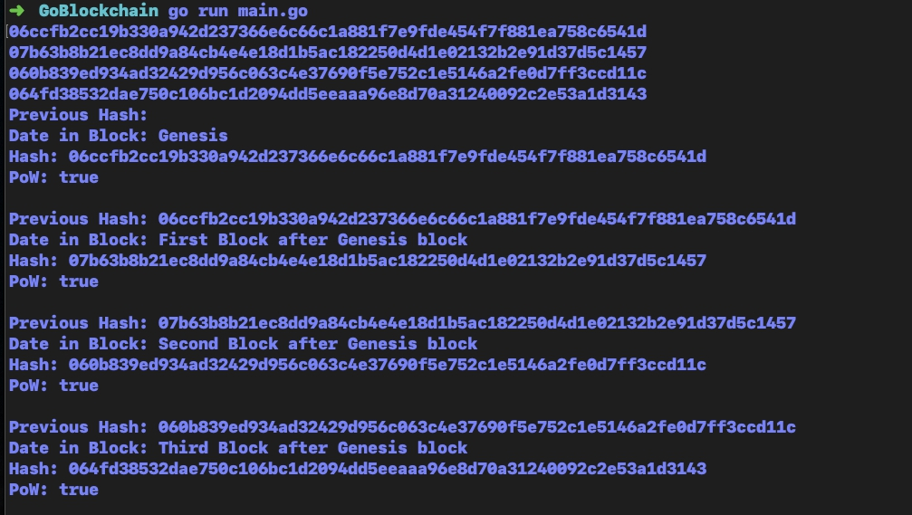

# Blockchain
Make Blockchain with POW system.



### Step 1. 
Clone this repository.


### Step 2.
open main.go and write down string data which would like to add to blockchain

```
	chain.AddBlock("First Block after Genesis block")
	chain.AddBlock("Second Block after Genesis block")
	chain.AddBlock("Third Block after Genesis block")
```
### Step 2. 
Terminal
```
$ cd GoBlockchain

$ run main.go
```

### Require
Install Golang to run this program.
